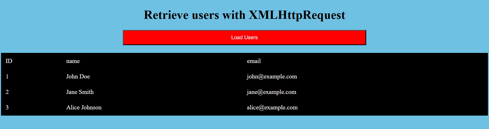

# AJAX-User-Loader-

## Project Description:
**AJAXUserLoader** is a web application designed to demonstrate how to fetch and display user data from a server asynchronously using AJAX with jQuery. The project includes an HTML page with a button to load user data and a table to display the retrieved information. When the button is clicked, an AJAX request is sent to a PHP script, which reads data from a JSON file and returns it as a JSON response. The application then dynamically updates the table with the user data without requiring a page reload.

### Components:
1. **HTML File (index.html)**:
    - Structure of the web page, including a button to load users and a table to display user information.
    - Linked to jQuery for making AJAX requests and a CSS file for styling.

2. **CSS File (style.css)**:
    - Styles the web page, button, and table for a better user experience.
    - Includes hover effects for interactive elements.

3. **JavaScript File (script.js)**:
    - Contains the logic to handle the button click event.
    - Sends an AJAX GET request to the server to fetch user data.
    - Updates the table with the fetched user data.

4. **PHP File (fetchData.php)**:
    - Handles the server-side logic to retrieve user data from a JSON file.
    - Returns the data as a JSON response.

### Workflow:
1. **User Interaction**:
    - User clicks the "Load Users" button.
    - JavaScript sends an AJAX request to the PHP script.

2. **Server Processing**:
    - PHP script reads data from `data.json` and returns it as a JSON response.

3. **Dynamic Update**:
    - JavaScript processes the server response and updates the HTML table to display user information.

### Features:
- Asynchronous data retrieval using AJAX.
- Dynamic content update without page reload.
- User-friendly design with styled components and interactive elements.

### Usage:
This project is ideal for learning how to implement AJAX-based data retrieval and dynamic content updates. It provides a practical example of client-server interaction, showcasing how to fetch and display data seamlessly in a web application.
